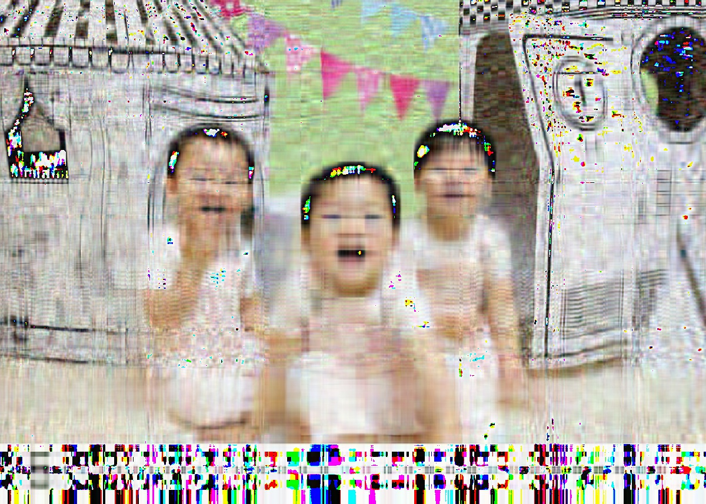
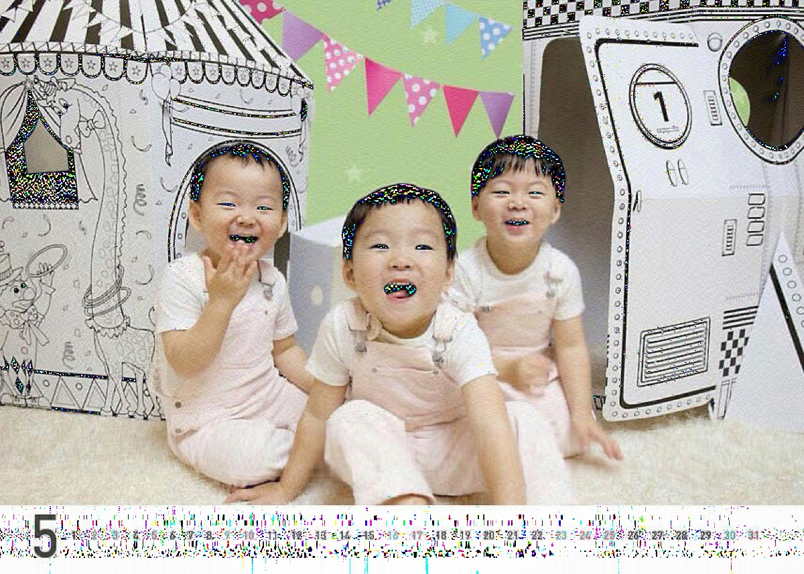

UECM3033 Assignment #2 Report
========================================================

- Prepared by: ** ONG YEE LENG **
- Tutorial Group: T2

--------------------------------------------------------

## Task 1 --  $LU$ Factorization or SOR method

The reports, codes and supporting documents are to be uploaded to Github at: 

[https://github.com/yeeleng/UECM3033_assign2]

Explain your selection criteria here.

First, check whether the matrix is strictly diagonally dominant matrix.
If it is strictly diagonally dominant, then solve it by LU Factorization.
Then check whether the matrix is positive definite.
If it is positive definite and all diagonal element are positive, then solve it by SOR method.
Otherwise, solve it by LU Factorization.

Explain how you implement your `task1.py` here.

Matrix A is classified as strictly diagonally dominant matrix when the diagonal element larger than the sum of other element on the row for all rows.
In python:
temp = np.diag(A) > np.sum(np.abs(A),1)
result = temp.all()
If the result is true, then A is a strictly diagonally dominant matrix.

Matrix A is classified as strictly positive definite matrix when np.linalg.cholesky(A) return no error.
If error received, solve it by LU Factorization. If no error received, then check for positive diagonal element. If all element is positive, then solve it by SOR method, otherwise, solve it by LU Factorization.

---------------------------------------------------------

## Task 2 -- SVD method and image compression

Put here your picture file (photo.tiff)

How many non zero element in $\Sigma$?

For a MxN sized picture, the number of zero in $\Sigma$ will be $(M \times N - N)$.

Put here your lower and better resolution pictures. Explain how you generate these pictures from `task2.py`.

The image with lower resolution.

The image with better resolution.

For each of the red, green and blue matrices, decompose into another 3 matrices $\Sigma, U$ and $V$.
Create a new matrix $\Sigma_{30}$ which is the same dimensions as $\Sigma$, but keeping the first 30 none zero elements as in $\Sigma$, and set all other none zero elements to zero.
Calculate a new $\Sigma_n$ with $n$ number of eigenvector used, 30 for lower resolution.
Create a better resolution color picture by repeating the same procedure as previously, but this time keep the first 200 none zero elements rather than 30.
Calculate a new $\Sigma_n$ with $n$ number of eigenvector used, 200 for better resolution.
Both picture is then obtain by compute the matrix by U $\Sigma_n$ V for each color layer, then merge together to become an image in RGB format.

What is a sparse matrix?

In numerical analysis, a sparse matrix is a matrix in which most of the elements are zero. 
In this assignment, $\Sigma_n$ is the example of sparse matrix which contain only $n$ non-zero element out of $M \times N$ element.

-----------------------------------

last modified: 11 March 2016
